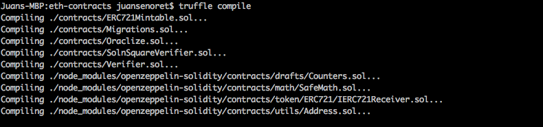
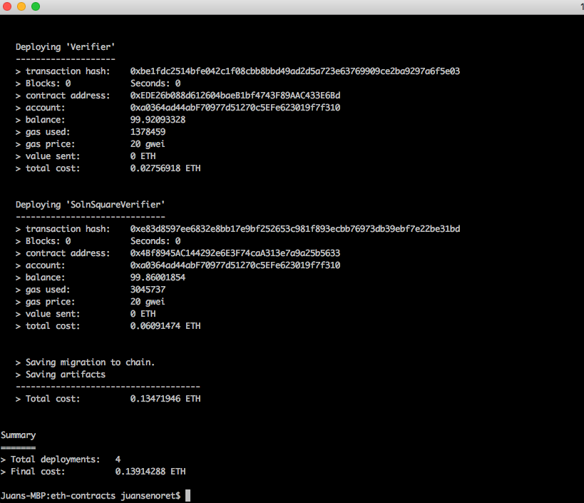
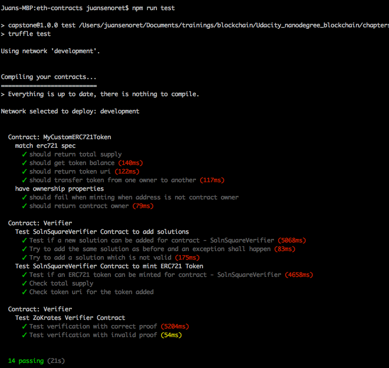
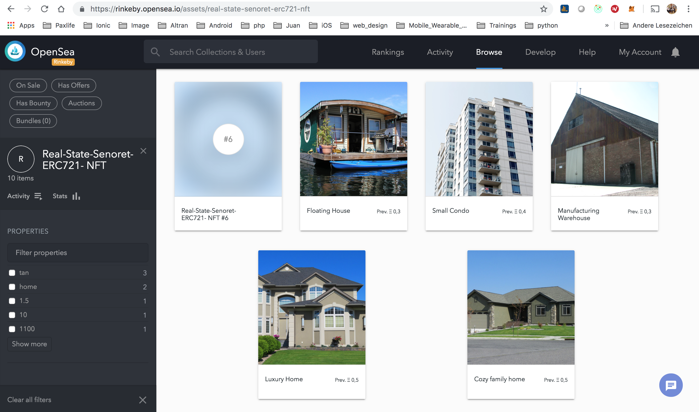
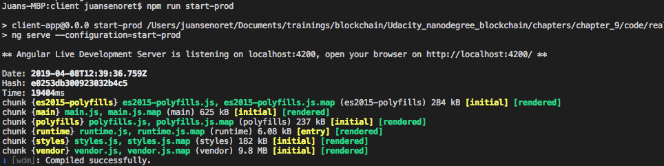
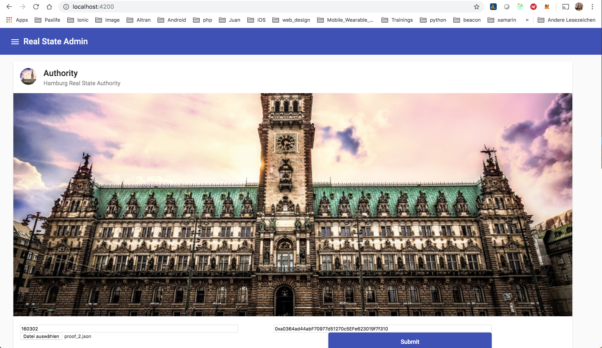

# Udacity Blockchain Real State Capstone Project

Real State App is a sample application project to demonstrate how to build using ERC721 NFT standard, zk-Snark (Zokrates framework) and OpenSea framework a market for reals state transfer.
During this project we will build our own NFT using the openzeppelin ERC721 standard and for token authentication we will use Zero Knowledges proof capabilities. Last but not the least we will list our tokens mint in our contract using OpenSea platform to build our own market place.

## Project description
- Smart contracts:
You will find the smart contract under "eth-contracts" folder. In this folder you will find a standard smart contracts development architecture based on Truffle.

- zk-Snark:
You will find the verification code and some proof_*.json files used to mint 10 tokens in the ERC721 smart contract deployed on Rinkeby network.

- OpenSea Market place:
To access to the store front for the ERC721 smart contract please use the following link:
[OpenSea Market Place Real State ERC721](https://rinkeby.opensea.io/assets/real-state-senoret-erc721-nft)

- Client (optional):
In the folder "client" you will find a client implentation built using Angular 7. With the client you will be able to mint your own token using a your proof.json validation file.

- Server (optional and under construction):
In the folder "server" you will find a ser implentation built using Hapi and Swagger framework. With the server you will be able to mint your own token using a your proof.json validation file. This part will be implemented in further steps.

## Getting Started

These instructions will get you a copy of the project up and running on your local machine for development and testing purposes.

### Pre-requisites

Please make sure you've already installed ganache-cli, Truffle and enabled MetaMask extension in your browser.

- Install ganache (graphical interface) and ganache-cli in your local environment
Donwload the installer from [https://truffleframework.com/ganache]

```
npm install -g ganache-cli
```

###  Libraries used
In each subfolder you will find the package.json to build each part. Here a summary of the most important packages used during the implementation.

- node.js (Version 10.15.1): As an asynchronous event driven JavaScript runtime, Node is designed to build scalable network applications.

- hapi (Version ^18.1.0): Node.js package to build REST APIs or web services

- web3 (Version 1.0.0-beta.46 and Version 1.0.0-beta.37 for the client): This is the Ethereum JavaScript API which connects to the Generic JSON RPC spec to connect to the ethereum node an interact with the smart contract.

- truffle-hdwallet-provider (Version 1.0.5): HD Wallet-enabled Web3 provider. Use it to sign transactions for addresses derived from a 12-word mnemonic. Package to access to a provider in case you want to deploy the smaret contract in a public network like Rinkeby, Ropsten, etc.

- Truffle (Version 5.0.7): Truffle is a development environment, testing framework and asset pipeline for Ethereum, aiming to make life as an Ethereum developer easier.


### Installing and user guide to use the client app

A step by step series of examples that tell you have to get a development env running

- Clone this repository:

```
git clone https://github.com/JuanSenoret/real-state-market-place.git
```

#### zk-Snark
**(Optional if you want to create your own proof.json files or modified the square.code file! If you only want to test the smart contract or access to the existing tokens in OpenSea store front you don't need to follow this step)**
- Intsall Docker in your computer.

[How to install Docker](https://docs.docker.com/install/)

- Change directory to ```zokrates``` folder.

```
cd zokrates
```

- Run ZoKrates docker container:

```
docker run -v <path to your project folder>:/home/zokrates/code -ti zokrates/zokrates /bin/bash
```

- Change directory to code/square

```
cd code/square
```

- Compile the program written in ZoKrates DSL

```
~/zokrates compile -i square.code
```

- Generate the Trusted Setup

```
~/zokrates setup
```

- Compute Witness

```
~/zokrates compute-witness -a 3 9
```

- Generate Proof

```
~/zokrates generate-proof
```

- Export Verifier.sol contract

```
~/zokrates export-verifier
```


#### Smart Contracts
- Change directory to ```eth-contracts``` folder and install all requisite npm packages (as listed in ```package.json```):

```
cd eth-contracts
npm install
```

- Launch Ganache: I prefer to use the Ganache GUI instead of ganache-cli but only take in consideration to use the port 7545. Otherweise you have to update several configuration files in which this port is hard coded. Other consideration is to configure your ganache to use at least 40 accounts. When you want to test the oracle part it will be necessary to have this amount of accounts

- Copy the truffle-example.js and create a new file truffle.js.

**(Optional if you want to deploy the contract in a public network like Rinkeby!)** Change the constant MNEMONIC with your account menomic and change API_KEY with your infura API Key

- Compile smart contracts:

```
truffle compile
```

Your terminal should look something like this:


This will create the smart contract artifacts in folder ```eth-contracts\build\contracts```.

- Migrate smart contracts to the locally running blockchain, ganache GUI or ganache-cli:

```
truffle migrate --network development
```

Your terminal should look something like this:



In ```eth-contracts\migrations\2_deploy_contracts.js``` file you can see that I have implemented a feature to copy the contracts ABI and addresses to the corresponding folders in client and server parts. In that case you don´t have to copy manualy the ABI and addresses each time that you migrate a new smart contract to your local ganache network.

- Test smart contracts:

To test the oracle part I have created a separate test file. You will find under ```eth-contracts\test\*.js```. To execute it please call it using the following npm script

```
npm run test
```

With that script you will run the three tests files. Your terminal should look something like this:



All 14 tests shall pass.

**(Assumption: in the SolnSquareVerifier contract I am verifing for each token token mint if the solution is unique and pass the verification)**


#### Deployment in Rinkeby network and search the tokens mint using OpenSea store front.

- Address for the deployed ERC721 contract in Rinkeby network:

```https://rinkeby.etherscan.io/address/0x30fc45474ab2f7F39424fBD289F17eb083DAD937```

Here you can check all the transactions over the smart contract

- Address to access to the OpenSea store front and the tokens list:

```https://rinkeby.opensea.io/assets/real-state-senoret-erc721-nft```




#### Use the client to mint new tokens
**(Optional to mint new tokens in the ERC721 smart contract!)**
- Be sure to create new proof.js files using the zokrates framework. The 10 existing proof_*.json files have been already used to mint the 10 existing tokens in the ERC721 contract.

- Change directory to ```client``` folder and install all requisite npm packages (as listed in ```package.json```):

```
cd client
npm install
```

- Start the client app to connect to the Rinkeby network (you can deploy the smart contract localy using ganache and call the client to connect to your local network using start-dev script):

```
npm run start-prod
```

Your terminal should look something like this:



After start the local Angular frontend server you can open the app in a browser calling http://localhost:4200



- Using the client you can mint a new token. Fill the tokenId and address fields and select the proof.json file.


# Project Resources

* [Remix - Solidity IDE](https://remix.ethereum.org/)
* [Visual Studio Code](https://code.visualstudio.com/)
* [Truffle Framework](https://truffleframework.com/)
* [Ganache - One Click Blockchain](https://truffleframework.com/ganache)
* [Open Zeppelin ](https://openzeppelin.org/)
* [Interactive zero knowledge 3-colorability demonstration](http://web.mit.edu/~ezyang/Public/graph/svg.html)
* [Docker](https://docs.docker.com/install/)
* [ZoKrates](https://github.com/Zokrates/ZoKrates)
* [OpenSea](https://docs.opensea.io/)
